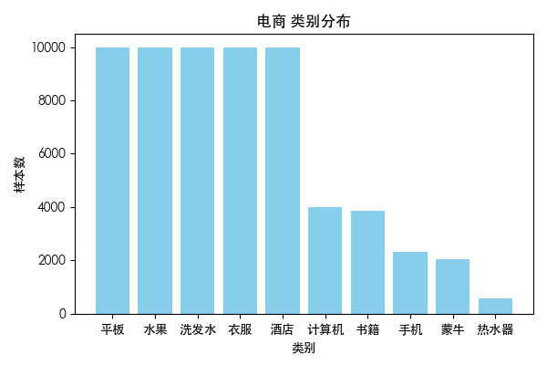
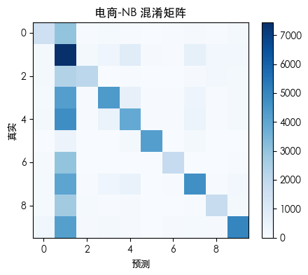

# 中文情感分析与主题建模实验

<p align="center">
	
	
	
	
	
</p>


# 中文情感分析与主题建模实验


---

## 项目简介 | Project Introduction

本项目针对中文电商、酒店、外卖评论数据，完成了数据检查、预处理、情感分析、分词、LDA主题建模等实验任务，并自动生成实验报告。适用于NLP课程实验、文本分类与主题建模入门。

This project provides a full pipeline for Chinese sentiment analysis and topic modeling on e-commerce, hotel, and takeaway review datasets. It includes data inspection, preprocessing, sentiment labeling, classification, LDA topic modeling, and automated report generation.

## 目录结构 | Directory Structure

```
├── NLP数据集/                # 原始数据集
│   ├── 电商评论数据/
│   │   └── online_shopping_10_cats.csv
│   ├── 酒店评论数据/
│   │   └── ChnSentiCorp_htl_all.csv
│   └── 外卖评论数据/
│       └── waimai_10k.csv
├── scripts/                  # 主要脚本
│   ├── 01_inspect_datasets.py
│   ├── 02_preprocess_and_eda.py
│   ├── 03_label_and_model.py
│   └── 04_lda_by_sentiment.py
├── output/                   # 中间与最终输出
│   ├── samples_inspection.csv
│   ├── eda_stats.csv
│   ├── length_hist_*.png
│   ├── labels_*.csv
│   ├── classification_report_*.txt
│   └── lda_topics_*.txt
├── results/                  # 结果汇总（如有）
├── experiment_report_final.docx  # 自动生成的实验报告
├── requirements.txt
└── README.md
```

## 数据集说明 | Dataset Description

- 电商评论数据：`NLP数据集/电商评论数据/online_shopping_10_cats.csv`
- 酒店评论数据：`NLP数据集/酒店评论数据/ChnSentiCorp_htl_all.csv`
- 外卖评论数据：`NLP数据集/外卖评论数据/waimai_10k.csv`

每个数据集均为CSV格式，包含文本内容及标签（部分需自动生成）。

## 依赖环境 | Requirements

- Python 3.8+
- 推荐使用虚拟环境（venv/conda）
- 依赖安装：

```bash
pip install -r requirements.txt
```

## 快速开始 | Quick Start

1. 创建并激活Python环境
2. 安装依赖
3. 运行数据检查脚本：

```bash
python scripts/01_inspect_datasets.py
```

输出：控制台显示每个数据集的行数、列名、前5条样本，并在`output/`目录写入`samples_inspection.csv`。


## 完整流程 | Full Pipeline

1. 数据集结构检查与样本展示
	```bash
	python scripts/01_inspect_datasets.py
	```
	- 自动检测编码，展示每个数据集的行数、列名、样本，并导出样本预览表。

2. 分词、统计与可视化（预处理与EDA）
	```bash
	python scripts/02_preprocess_and_eda.py
	```
	- 分词、去停用词，统计文本长度，生成分布直方图，输出处理后CSV。

3. 情感伪标签生成与基线分类
	```bash
	python scripts/03_label_and_model.py
	```
	- 用SnowNLP自动打分，生成正负标签，训练朴素贝叶斯和SVM，输出分类报告。

4. LDA主题建模（正/负样本分开）
	```bash
	python scripts/04_lda_by_sentiment.py
	```
	- 对正负样本分别做LDA主题分析，输出每类主题关键词。

5. 自动化全流程与实验报告生成
	```bash
	python scripts/10_balance_and_eda_report.py
	```
	- 自动完成数据平衡、EDA、模型调参、评估与实验报告（docx）生成。


## 结果与报告 | Results & Report

- 所有中间结果、可视化图、分类报告、主题分析等均输出到`output/`或`results/`目录。
- 自动生成的实验报告`experiment_report_final.docx`，包含三类数据集的完整分析与模型评估。

### 代表性结果展示

类别分布示例：

<p align="center">
	
</p>

模型混淆矩阵示例：

<p align="center">
	
</p>

## 参考与致谢 | Reference & Acknowledgement

- 部分数据集来源于公开NLP竞赛与学术资源
- 代码参考了scikit-learn、pandas、snownlp等开源项目

---
如有问题欢迎提issue或PR！