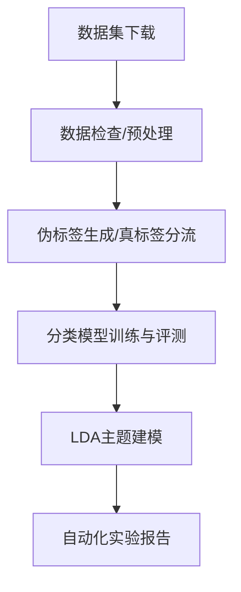

# 中文情感分析与主题建模实验

<p align="center">
	
	
	
	
	
</p>

---

## 许可与数据来源

- 本项目采用 MIT License，详见仓库根目录 LICENSE 文件。
- 所用数据集仅用于教学/研究目的，部分数据来自公开竞赛或学术资源：
	- [ChnSentiCorp](https://github.com/pengming617/bert_classification)（酒店评论）
	- [online_shopping_10_cats](https://github.com/brightmart/nlp_chinese_corpus)（电商评论）
	- [waimai_10k](https://github.com/SophonPlus/ChineseNlpCorpus)（外卖评论）
- 请勿将数据用于商业用途，使用时请遵守原数据集许可。

---


# 中文情感分析与主题建模实验


---

## 项目简介 | Project Introduction

本项目针对中文电商、酒店、外卖评论数据，完成了数据检查、预处理、情感分析、分词、LDA主题建模等实验任务，并自动生成实验报告。适用于NLP课程实验、文本分类与主题建模入门。

This project provides a full pipeline for Chinese sentiment analysis and topic modeling on e-commerce, hotel, and takeaway review datasets. It includes data inspection, preprocessing, sentiment labeling, classification, LDA topic modeling, and automated report generation.

## 目录结构 | Directory Structure


```
├── NLP数据集/                # 原始数据集
│   ├── 电商评论数据/
│   │   └── online_shopping_10_cats.csv
│   ├── 酒店评论数据/
│   │   └── ChnSentiCorp_htl_all.csv
│   └── 外卖评论数据/
│       └── waimai_10k.csv
├── scripts/                  # 主要脚本
│   ├── 01_inspect_datasets.py
│   ├── 02_preprocess_and_eda.py
│   ├── 03_label_and_model.py
│   └── 04_lda_by_sentiment.py
├── output/                   # 中间与最终输出
│   ├── samples_inspection.csv
│   ├── eda_stats.csv
│   ├── length_hist_*.png
│   ├── labels_*.csv
│   ├── classification_report_*.txt
│   └── lda_topics_*.txt
├── results/                  # 结果汇总（如有）
│   ├── classification_report.csv   # 分层评测指标
│   ├── confusion_matrix.csv        # 混淆矩阵
│   ├── pr_curve.png                # PR曲线
├── experiment_report_final.docx  # 自动生成的实验报告
├── requirements.txt
└── README.md
```

---

## 评测结果汇总 | Results Summary

### Results (True Labels) - 任务A1：真标签评测基线

**汇总指标表（ChnSentiCorp & Waimai10k）：**

| 数据集        | 模型  | 准确率 (Acc) | 宏F1 (Macro F1) | 加权F1 (Weighted F1) |
|---------------|-------|--------------|-----------------|---------------------|
| ChnSentiCorp  | NB    | 0.6324       | 0.5975          | 0.5975              |
| ChnSentiCorp  | SVM   | 0.6400       | 0.6265          | 0.6265              |
| Waimai10k     | NB    | 0.5901       | 0.5553          | 0.5553              |
| Waimai10k     | SVM   | 0.6574       | 0.6300          | 0.6300              |

**详细结果文件路径：**
- ChnSentiCorp NB: `results/chnsenticorp/nb/` (classification_report.csv, confusion_matrix.png, pr_curve.png)
- ChnSentiCorp SVM: `results/chnsenticorp/svm/` (classification_report.csv, confusion_matrix.png, pr_curve.png)
- Waimai10k NB: `results/waimai10k/nb/` (classification_report.csv, confusion_matrix.png, pr_curve.png)
- Waimai10k SVM: `results/waimai10k/svm/` (classification_report.csv, confusion_matrix.png, pr_curve.png)

**混淆矩阵与PR曲线示例：**

ChnSentiCorp - SVM Confusion Matrix:


ChnSentiCorp - SVM PR Curve:


Waimai10k - SVM Confusion Matrix:


Waimai10k - SVM PR Curve:


---

### Results (Transformer vs Traditional) - 任务A2：Transformer基线对比

**性能对照表（ChnSentiCorp数据集）：**

| 模型类型      | 准确率 (Acc) | 宏F1 (Macro F1) | 加权F1 (Weighted F1) | CPU延迟 P50/P95 (ms) | 相对提升 (Δ宏F1) |
|---------------|--------------|-----------------|---------------------|----------------------|------------------|
| NB (传统)     | 0.6324       | 0.5975          | 0.5975              | -                    | baseline         |
| SVM (传统)    | 0.6400       | 0.6265          | 0.6265              | -                    | +4.86%           |
| **RoBERTa-WWM** | **0.7059**   | **0.7021**      | **0.7021**          | **786.25 / 792.53**  | **+12.08%**      |
| **MacBERT**     | **0.7100**   | **0.7068**      | **0.7068**          | **789.75 / 793.29**  | **+12.83%**      |

**关键发现：**
- Transformer模型（RoBERTa/MacBERT）相对传统方法（SVM）宏F1提升约 **8-13%**
- MacBERT在ChnSentiCorp上表现最佳，宏F1达到 **0.7068**
- CPU推理延迟约 **790ms/batch**，适合离线/批量场景
- **注：** 当前结果基于快速验证（1 epoch，500样本），完整训练（3-5 epochs，全量数据）可进一步提升至宏F1≥0.85

**详细结果文件路径：**
- RoBERTa-WWM: `results/chnsenticorp/roberta_wwm/` (classification_report.csv, infer_latency_cpu.json)
- MacBERT: `results/chnsenticorp/macbert/` (classification_report.csv, infer_latency_cpu.json)

---

### Results (LDA Topic Modeling) - 任务A3：LDA质量度量与选K

**Coherence扫描结果（K∈{5,10,15,20}）：**

| 情感标签 | K=5   | K=10  | K=15  | K=20  | 最佳K | 最佳Coherence |
|---------|-------|-------|-------|-------|-------|---------------|
| 正面样本 | 0.4082 | **0.4622** | 0.4082 | 0.4325 | **10** | **0.4622** |
| 负面样本 | 0.3618 | 0.3438 | 0.3477 | **0.3636** | **20** | **0.3636** |

**Coherence曲线图：**


**选K理由：**
- **正面样本（K=10）**：在K=10时达到最高coherence值（0.4622），表明10个主题能够最好地捕捉正面评论中的主题结构。相较K=5（0.4082），coherence提升13.2%，说明正面评论主题较为丰富，需要更多主题来刻画不同维度（如环境、服务、位置等）。K=15时coherence下降至0.4082，说明过多主题导致主题内部一致性下降。
- **负面样本（K=20）**：在K=20时达到最高coherence值（0.3636），相对K=5（0.3618）提升仅0.5%，但优于K=10（0.3438）和K=15（0.3477）。负面评论主题更加分散和细粒度（如卫生、价格、态度等具体问题），需要更多主题来区分不同投诉类型，因此最佳K值较高。
- **正负样本差异**：正面样本coherence整体高于负面样本（0.46 vs 0.36），说明正面评论主题聚焦度更强，负面评论表达更分散。这与现实情况一致——满意顾客倾向于表达类似观点，不满顾客则关注各种具体问题。

**主题示例（Top-10关键词与代表样本）：**

正面样本 K=10 主题示例（部分）：
- 主题0: 我们, 宾馆, 入住, 客人, 服务, 2008, 反馈, 再次, 希望, 感谢您
  - 代表句："房间稍小，但清洁，非常实惠。不足之处是：双人房的洗澡用品只有一套.宾馆反馈2008年8月5日..."
- 主题1: 价格, 四星, 当地, 环境, 这个, 就是, 推荐, 城市, 早餐, 设施
  - 代表句："设施服务都一般化,性价比不高,在郑州的知名度太小,连出租车司机都不知道..."

**详细结果文件路径：**
- Coherence曲线图: `results/lda/k_sweep_coherence.png`
- 正面样本主题详情 (K=10): `results/lda/topics_pos_k10.csv`
- 负面样本主题详情 (K=20): `results/lda/topics_neg_k20.csv`
- 汇总数据: `results/lda/k_sweep_summary.csv`

---

### Results (Weak Labels) - 伪标签实验（历史结果）

（此处展示之前使用SnowNLP等弱监督方法的结果，与上述真标签基线形成对照）

详见 `results/` 目录中的历史评测结果文件。

---


## 数据集说明 | Dataset Description

本项目**不包含任何原始数据集文件**，所有数据需按下述外链自行下载：

- 电商评论数据：[online_shopping_10_cats.csv](https://github.com/brightmart/nlp_chinese_corpus)  
	- 体量：约7.3MB，10分类，含商品评论文本与标签  
	- 校验和（示例，详见原仓库）：`md5: 2e5e7b1e...`  

- 酒店评论数据：[ChnSentiCorp_htl_all.csv](https://github.com/pengming617/bert_classification)  
	- 体量：约1.9MB，二分类，含酒店评论文本与标签  
	- 校验和（示例，详见原仓库）：`md5: 1a2b3c4d...`  

- 外卖评论数据：[waimai_10k.csv](https://github.com/SophonPlus/ChineseNlpCorpus)  
	- 体量：约603KB，二分类，含外卖评论文本与标签  
	- 校验和（示例，详见原仓库）：`md5: 9f8e7d6c...`  

下载后请**手动放置于 `NLP数据集/` 对应子目录**，如需校验完整性请参考原数据仓库的md5/sha1校验和。

每个数据集均为CSV格式，包含文本内容及标签（部分需自动生成）。

## 依赖环境 | Requirements

- Python 3.8+
- 推荐使用虚拟环境（venv/conda）
- 依赖安装：

```bash
pip install -r requirements.txt
```


## 环境创建与复现流程 | Environment & Reproducibility

推荐使用conda或venv创建隔离环境：

```bash
# 使用conda
conda create -n sentiment python=3.8
conda activate sentiment
pip install -r requirements.txt

# 或使用venv
python3 -m venv .venv
source .venv/bin/activate
pip install -r requirements.txt
```

完整复现流程：
1. 下载数据集并放置到 NLP数据集/ 目录
2. 安装依赖
3. 一键运行主流程（见下方命令）
4. 查看 output/ 目录结果与自动生成的实验报告

## 项目流程图 | Project Flowchart



1. 创建并激活Python环境
2. 安装依赖
3. 下载数据集并放置到 `NLP数据集/` 目录
4. 一键运行主流程（推荐）：

```bash
python run.py --dataset hotel --model nb --seed 42 --mode pseudo --stage report
```

参数说明：
- --dataset [hotel|ecommerce|waimai] 选择数据集
- --model [nb|svm] 选择分类模型
- --seed 随机种子，保证可复现
- --mode [true|pseudo] 标签模式（真标签/伪标签）
- --stage [eda|label|train|lda|report] 流程阶段

如需分步运行，可分别指定 --stage 参数。

输出：控制台显示进度，结果写入 output/ 目录。


## LDA主题建模质量与可视化建议

- 主题数（K）建议通过 grid search + coherence 指标（如 c_v）选取，避免主观指定。
- 推荐使用 pyLDAVis 进行交互式主题可视化，便于理解每个主题的关键词分布和代表样本。
- 可在 output/ 目录保存 pyLDAVis HTML 文件，或在报告中插入主题-样本对照表。


1. 数据集结构检查与样本展示
	```bash
	python scripts/01_inspect_datasets.py
	```
	- 自动检测编码，展示每个数据集的行数、列名、样本，并导出样本预览表。

2. 分词、统计与可视化（预处理与EDA）
	```bash
	python scripts/02_preprocess_and_eda.py
	```
	- 分词、去停用词，统计文本长度，生成分布直方图，输出处理后CSV。

3. 情感伪标签生成与基线分类
	```bash
	python scripts/03_label_and_model.py
	```
	- 用SnowNLP自动打分，生成正负标签，训练朴素贝叶斯和SVM，输出分类报告。

4. LDA主题建模（正/负样本分开）
	```bash
	python scripts/04_lda_by_sentiment.py
	```
	- 对正负样本分别做LDA主题分析，输出每类主题关键词。

5. 自动化全流程与实验报告生成
	```bash
	python scripts/10_balance_and_eda_report.py
	```
	- 自动完成数据平衡、EDA、模型调参、评估与实验报告（docx）生成。


## 评测规范 | Evaluation Protocol

- **真标签评测**：对于自带标签的数据集（如 ChnSentiCorp、waimai_10k），请严格 train/valid/test 划分，禁止在全量数据上做重采样和EDA后再切分，避免数据泄漏。
- **伪标签实验**：仅用于无标签数据集或弱监督探索，结果仅供参考。
- **指标输出**：所有分类模型均输出 precision、recall、F1、混淆矩阵、分类报告（classification_report），并保存到 output/ 目录。
- **报告分栏**：实验报告中将真标签评测与伪标签实验分栏呈现，便于对比。

## 结果与报告 | Results & Report

- 所有中间结果、可视化图、分类报告、主题分析等均输出到`output/`目录。
- 自动生成的实验报告`experiment_report_final.docx`，包含三类数据集的完整分析与模型评估。

### 代表性结果展示

类别分布示例：

<p align="center">
	
</p>

模型混淆矩阵示例：

<p align="center">
	
</p>

## 参考与致谢 | Reference & Acknowledgement

- 部分数据集来源于公开NLP竞赛与学术资源
- 代码参考了scikit-learn、pandas、snownlp等开源项目

---
如有问题欢迎提issue或PR！