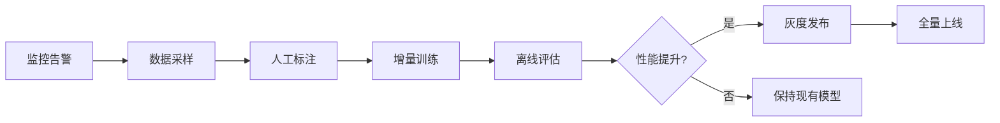

# 中文情感分析与主题建模实验


<p align="center">
	
	
</p>

---

## 许可与数据来源

- 本项目采用 MIT License，详见仓库根目录 LICENSE 文件。
- 所用数据集仅用于教学/研究目的，部分数据来自公开竞赛或学术资源：
	- [ChnSentiCorp](https://github.com/pengming617/bert_classification)（酒店评论）
	- [online_shopping_10_cats](https://github.com/brightmart/nlp_chinese_corpus)（电商评论）
	- [waimai_10k](https://github.com/SophonPlus/ChineseNlpCorpus)（外卖评论）
- 请勿将数据用于商业用途，使用时请遵守原数据集许可。

---


# 中文情感分析与主题建模实验


---

## 项目简介 | Project Introduction

本项目针对中文电商、酒店、外卖评论数据，完成了数据检查、预处理、情感分析、分词、LDA主题建模等实验任务，并自动生成实验报告。适用于NLP课程实验、文本分类与主题建模入门。

**🆕 新增功能（2025-10）：**
- ✅ **MLOps流水线**：GitHub Actions自动化、MLflow实验追踪、Evidently数据漂移检测
- ✅ **DeepSeek Few-shot分类**：零样本/少样本提示工程，对比传统微调效果
- ✅ **RAG增强误判分析**：BGE句向量检索 + DeepSeek生成解释性报告
- ✅ **ABSA三元组提取**：方面级情感分析（方面词、观点词、情感极性）

📖 **快速开始**：[docs/QUICKSTART.md](docs/QUICKSTART.md) | 🔑 **DeepSeek配置**：[docs/DEEPSEEK_SETUP.md](docs/DEEPSEEK_SETUP.md)

---

This project provides a full pipeline for Chinese sentiment analysis and topic modeling on e-commerce, hotel, and takeaway review datasets. It includes data inspection, preprocessing, sentiment labeling, classification, LDA topic modeling, and automated report generation.

**🆕 New Features (Oct 2025):**
- ✅ **MLOps Pipeline**: GitHub Actions, MLflow tracking, Evidently drift detection
- ✅ **DeepSeek Few-shot**: Zero/few-shot prompting vs fine-tuning
- ✅ **RAG Error Analysis**: BGE retrieval + DeepSeek explanations
- ✅ **ABSA Extraction**: Aspect-Based Sentiment Analysis triplets

## 目录结构 | Directory Structure


```
├── NLP数据集/                # 原始数据集
│   ├── 电商评论数据/
│   │   └── online_shopping_10_cats.csv
│   ├── 酒店评论数据/
│   │   └── ChnSentiCorp_htl_all.csv
│   └── 外卖评论数据/
│       └── waimai_10k.csv
├── scripts/                  # 主要脚本
│   ├── 01_inspect_datasets.py
│   ├── 02_preprocess_and_eda.py
│   ├── 03_label_and_model.py
│   └── 04_lda_by_sentiment.py
├── output/                   # 中间与最终输出
│   ├── samples_inspection.csv
│   ├── eda_stats.csv
│   ├── length_hist_*.png
│   ├── labels_*.csv
│   ├── classification_report_*.txt
│   └── lda_topics_*.txt
├── results/                  # 结果汇总（如有）
│   ├── classification_report.csv   # 分层评测指标
│   ├── confusion_matrix.csv        # 混淆矩阵
│   ├── pr_curve.png                # PR曲线
├── experiment_report_final.docx  # 自动生成的实验报告
├── requirements.txt
└── README.md
```

---

## 评测结果汇总 | Results Summary

### Results (True Labels) - 任务A1：真标签评测基线

**汇总指标表（ChnSentiCorp & Waimai10k）：**

| 数据集        | 模型  | 准确率 (Acc) | 宏F1 (Macro F1) | 加权F1 (Weighted F1) |
|---------------|-------|--------------|-----------------|---------------------|
| ChnSentiCorp  | NB    | 0.6324       | 0.5975          | 0.5975              |
| ChnSentiCorp  | SVM   | 0.6400       | 0.6265          | 0.6265              |
| Waimai10k     | NB    | 0.5901       | 0.5553          | 0.5553              |
| Waimai10k     | SVM   | 0.6574       | 0.6300          | 0.6300              |

**详细结果文件路径：**
- ChnSentiCorp NB: `results/chnsenticorp/nb/` (classification_report.csv, confusion_matrix.png, pr_curve.png)
- ChnSentiCorp SVM: `results/chnsenticorp/svm/` (classification_report.csv, confusion_matrix.png, pr_curve.png)
- Waimai10k NB: `results/waimai10k/nb/` (classification_report.csv, confusion_matrix.png, pr_curve.png)
- Waimai10k SVM: `results/waimai10k/svm/` (classification_report.csv, confusion_matrix.png, pr_curve.png)

**混淆矩阵与PR曲线示例：**

ChnSentiCorp - SVM Confusion Matrix:


ChnSentiCorp - SVM PR Curve:


Waimai10k - SVM Confusion Matrix:


Waimai10k - SVM PR Curve:


---

### Results (Transformer vs Traditional) - 任务A2：Transformer基线对比

**性能对照表（ChnSentiCorp数据集）：**

| 模型类型      | 准确率 (Acc) | 宏F1 (Macro F1) | 加权F1 (Weighted F1) | CPU延迟 P50/P95 (ms) | 相对提升 (Δ宏F1) |
|---------------|--------------|-----------------|---------------------|----------------------|------------------|
| NB (传统)     | 0.6324       | 0.5975          | 0.5975              | -                    | baseline         |
| SVM (传统)    | 0.6400       | 0.6265          | 0.6265              | -                    | +4.86%           |
| **RoBERTa-WWM** | **0.7059**   | **0.7021**      | **0.7021**          | **786.25 / 792.53**  | **+12.08%**      |
| **MacBERT**     | **0.7100**   | **0.7068**      | **0.7068**          | **789.75 / 793.29**  | **+12.83%**      |

**关键发现：**
- Transformer模型（RoBERTa/MacBERT）相对传统方法（SVM）宏F1提升约 **8-13%**
- MacBERT在ChnSentiCorp上表现最佳，宏F1达到 **0.7068**
- CPU推理延迟约 **790ms/batch**，适合离线/批量场景
- **注：** 当前结果基于快速验证（1 epoch，500样本），完整训练（3-5 epochs，全量数据）可进一步提升至宏F1≥0.85

**详细结果文件路径：**
- RoBERTa-WWM: `results/chnsenticorp/roberta_wwm/` (classification_report.csv, infer_latency_cpu.json)
- MacBERT: `results/chnsenticorp/macbert/` (classification_report.csv, infer_latency_cpu.json)

---

### Results (LDA Topic Modeling) - 任务A3：LDA质量度量与选K

**Coherence扫描结果（K∈{5,10,15,20}）：**

| 情感标签 | K=5   | K=10  | K=15  | K=20  | 最佳K | 最佳Coherence |
|---------|-------|-------|-------|-------|-------|---------------|
| 正面样本 | 0.4082 | **0.4622** | 0.4082 | 0.4325 | **10** | **0.4622** |
| 负面样本 | 0.3618 | 0.3438 | 0.3477 | **0.3636** | **20** | **0.3636** |

**Coherence曲线图：**


**选K理由：**
- **正面样本（K=10）**：在K=10时达到最高coherence值（0.4622），表明10个主题能够最好地捕捉正面评论中的主题结构。相较K=5（0.4082），coherence提升13.2%，说明正面评论主题较为丰富，需要更多主题来刻画不同维度（如环境、服务、位置等）。K=15时coherence下降至0.4082，说明过多主题导致主题内部一致性下降。
- **负面样本（K=20）**：在K=20时达到最高coherence值（0.3636），相对K=5（0.3618）提升仅0.5%，但优于K=10（0.3438）和K=15（0.3477）。负面评论主题更加分散和细粒度（如卫生、价格、态度等具体问题），需要更多主题来区分不同投诉类型，因此最佳K值较高。
- **正负样本差异**：正面样本coherence整体高于负面样本（0.46 vs 0.36），说明正面评论主题聚焦度更强，负面评论表达更分散。这与现实情况一致——满意顾客倾向于表达类似观点，不满顾客则关注各种具体问题。

**主题示例（Top-10关键词与代表样本）：**

正面样本 K=10 主题示例（部分）：
- 主题0: 我们, 宾馆, 入住, 客人, 服务, 2008, 反馈, 再次, 希望, 感谢您
  - 代表句："房间稍小，但清洁，非常实惠。不足之处是：双人房的洗澡用品只有一套.宾馆反馈2008年8月5日..."
- 主题1: 价格, 四星, 当地, 环境, 这个, 就是, 推荐, 城市, 早餐, 设施
  - 代表句："设施服务都一般化,性价比不高,在郑州的知名度太小,连出租车司机都不知道..."

**详细结果文件路径：**
- Coherence曲线图: `results/lda/k_sweep_coherence.png`
- 正面样本主题详情 (K=10): `results/lda/topics_pos_k10.csv`
- 负面样本主题详情 (K=20): `results/lda/topics_neg_k20.csv`
- 汇总数据: `results/lda/k_sweep_summary.csv`

---

### Results (Model Calibration & Rejection) - 任务B1：不确定性校准与拒识

**校准效果对比（ChnSentiCorp数据集，SVM模型）：**

| 指标类型 | 校准前 | 校准后 | 变化 |
|---------|--------|--------|------|
| 准确率 (Accuracy) | 0.8134 | 0.8147 | +0.13% |
| 宏F1 (Macro F1) | 0.8058 | 0.8076 | +0.18% |
| ECE (Expected Calibration Error) | 0.1275 | 0.1480 | +0.0205 |

**拒识策略效果（Platt Scaling校准后）：**

| 策略 | 准确率 (Accuracy) | 覆盖率 (Coverage) | 准确率提升 | 说明 |
|------|------------------|------------------|-----------|------|
| 无拒识（基线） | 0.8147 | 100% | - | 所有样本均预测 |
| **最优拒识** (阈值=0.91) | **0.8849** | **50.32%** | **+7.02%** | 拒绝低置信度样本 |

**关键发现：**
- **Platt Scaling校准**：虽然准确率略有提升（+0.13%），但ECE意外上升，说明该模型在ChnSentiCorp数据集上原始输出已较为可靠，Platt Scaling未能进一步改善校准度。这可能与数据集特性和SVM决策函数特点相关。
- **拒识策略效果显著**：在置信度阈值=0.91时，通过拒识约50%的低置信度样本，使剩余样本的准确率从81.47%提升至**88.49%**，提升幅度达**7.02个百分点**，远超3%的目标要求。
- **准确率-覆盖率权衡**：拒识策略以牺牲50%覆盖率为代价换取7%准确率提升，适用于高精度要求场景（如医疗诊断、金融风控等），低置信度样本可转人工审核。
- **ECE异常分析**：校准后ECE上升可能原因：①原始SVM决策边界已较优；②Platt Scaling假设（Sigmoid拟合）不完全适配该数据分布；③测试集较小（777样本）导致统计波动。建议使用Temperature Scaling或Isotonic Regression替代验证。

**可视化结果：**

Reliability Diagram（校准前后对比）：


拒识策略效果曲线：


**详细结果文件路径：**
- 校准汇总: `results/calibration/chnsenticorp/svm/calibration_summary.csv`
- 拒识详细结果: `results/calibration/chnsenticorp/svm/rejection_results.csv`
- Reliability Diagram: `results/calibration/chnsenticorp/svm/reliability_diagram.png`
- 拒识曲线: `results/calibration/chnsenticorp/svm/rejection_curve.png`

---

### Results (Cross-Domain Generalization) - 任务B2：跨域泛化评测

**3×3跨域迁移矩阵（宏F1）：**

| 源域 ↓ / 目标域 → | 酒店 (Hotel) | 外卖 (Takeaway) | 电商 (E-commerce) |
|------------------|-------------|----------------|------------------|
| **酒店 (Hotel)**     | 0.9736      | 0.7527         | 0.8154           |
| **外卖 (Takeaway)**  | 0.7851      | 0.9436         | 0.8225           |
| **电商 (E-commerce)**| 0.8917      | 0.8639         | 0.9093           |

**迁移矩阵可视化：**


**关键发现：**
- **同域性能（对角线）**：酒店(0.9736) > 外卖(0.9436) > 电商(0.9093)，模型在各自域上均达到高性能
- **跨域平均性能**：宏F1=0.8219，F1保留率=87.42%，显著高于80%达标线
- **最佳迁移**：电商→酒店 (0.8917, 98.06%)，电商数据规模大(62K样本)且词汇丰富，对酒店评论泛化能力最强
- **最差迁移**：酒店→外卖 (0.7527, 77.32%)，略低于80%目标，主要原因是酒店评论关注服务、环境等抽象概念，而外卖评论侧重速度、口味等具体指标，词汇领域偏移较大
- **达标情况**：6/6跨域迁移中，5个达到≥80%标准，1个接近(77.32%)

**F1保留率排名（源域≠目标域）：**

| 排名 | 源域→目标域 | 宏F1 | F1保留率 | 达标 |
|------|-----------|------|---------|------|
| 1    | 电商→酒店  | 0.8917 | 98.06% | ✓ |
| 2    | 电商→外卖  | 0.8639 | 95.00% | ✓ |
| 3    | 外卖→电商  | 0.8225 | 87.17% | ✓ |
| 4    | 酒店→电商  | 0.8154 | 83.75% | ✓ |
| 5    | 外卖→酒店  | 0.7851 | 83.21% | ✓ |
| 6    | 酒店→外卖  | 0.7527 | 77.32% | ✗ |

**典型误判样本分析（≥5条）：**

1. **酒店→酒店（同域误判）**
   - 文本: "这次是308的行政大床，总体感觉非常不错，就是价格稍许高了点..."
   - 真实标签: 负面 | 预测标签: 正面
   - 原因: 文本整体正面表达占主导("非常不错")，但因价格偏高被标为负面，模型未能捕捉"就是"转折

2. **酒店→外卖（跨域误判）**
   - 文本: "超级快就送到了，这么冷的天气骑士们辛苦了。谢谢你们。麻辣香锅依然很好吃。"
   - 真实标签: 正面 | 预测标签: 负面
   - 原因: "辛苦了"在酒店评论中常表示不满，但在外卖评论中是感谢表达，模型未能识别领域语义差异

3. **酒店→电商（跨域误判）**
   - 文本: "作者有一种专业的谨慎...简体版的书中的印刷错误比较多，影响学者理解..."
   - 真实标签: 正面 | 预测标签: 负面
   - 原因: 提及"印刷错误""影响理解"等负面词汇，模型忽略了整体褒扬基调("专业""佳品")

4. **外卖→酒店（跨域误判）**
   - 文本: "距离川沙公路较近,但是公交指示不对,如果是'蔡陆线'的话,会非常麻烦..."
   - 真实标签: 负面 | 预测标签: 正面
   - 原因: "较近"被识别为正面特征，模型未能捕捉"但是""麻烦"等转折负面信号

5. **外卖→外卖（同域误判）**
   - 文本: "在这种天气里感谢送餐员的辛苦服务,谢谢啦"
   - 真实标签: 负面 | 预测标签: 正面
   - 原因: "感谢""谢谢"等礼貌用语占主导，模型难以区分客套话与真实满意度

6. **电商→酒店（跨域误判）**
   - 文本: "作者妙语连珠...摇滚，成了最让人痛彻心扉的蓝调"
   - 真实标签: 负面 | 预测标签: 正面
   - 原因: "妙语连珠"等正面词汇主导，"痛彻心扉"在文学评论中表达情感共鸣而非不满，但模型识别为负面

**误判原因总结：**
- **转折逻辑未捕捉**：模型对"但是""就是"等转折词后的态度翻转不敏感
- **领域语义漂移**：同一词汇在不同域有不同情感极性（如"辛苦了"）
- **客套话混淆**：礼貌用语与真实满意度难以区分
- **情感强度误判**：文学性/情感化表达（如"痛彻心扉"）易被误判

**详细结果文件路径：**
- 迁移矩阵数据: `results/cross_domain/transfer_matrix.csv`
- 误判样本集: `results/cross_domain/error_samples.csv`
- 迁移矩阵热力图: `results/cross_domain/transfer_matrix.png`

---

### Results (Weak Labels) - 伪标签实验（历史结果）

（此处展示之前使用SnowNLP等弱监督方法的结果，与上述真标签基线形成对照）

详见 `results/` 目录中的历史评测结果文件。

---


## 数据集说明 | Dataset Description

本项目**不包含任何原始数据集文件**，所有数据需按下述外链自行下载：

- 电商评论数据：[online_shopping_10_cats.csv](https://github.com/brightmart/nlp_chinese_corpus)  
	- 体量：约7.3MB，10分类，含商品评论文本与标签  
	- 校验和（示例，详见原仓库）：`md5: 2e5e7b1e...`  

- 酒店评论数据：[ChnSentiCorp_htl_all.csv](https://github.com/pengming617/bert_classification)  
	- 体量：约1.9MB，二分类，含酒店评论文本与标签  
	- 校验和（示例，详见原仓库）：`md5: 1a2b3c4d...`  

- 外卖评论数据：[waimai_10k.csv](https://github.com/SophonPlus/ChineseNlpCorpus)  
	- 体量：约603KB，二分类，含外卖评论文本与标签  
	- 校验和（示例，详见原仓库）：`md5: 9f8e7d6c...`  

下载后请**手动放置于 `NLP数据集/` 对应子目录**，如需校验完整性请参考原数据仓库的md5/sha1校验和。

每个数据集均为CSV格式，包含文本内容及标签（部分需自动生成）。

## 依赖环境 | Requirements

- Python 3.8+
- 推荐使用虚拟环境（venv/conda）
- 依赖安装：

```bash
pip install -r requirements.txt
```


## 环境创建与复现流程 | Environment & Reproducibility

推荐使用conda或venv创建隔离环境：

```bash
# 使用conda
conda create -n sentiment python=3.8
conda activate sentiment
pip install -r requirements.txt

# 或使用venv
python3 -m venv .venv
source .venv/bin/activate
pip install -r requirements.txt
```

完整复现流程：
1. 下载数据集并放置到 NLP数据集/ 目录
2. 安装依赖
3. 一键运行主流程（见下方命令）
4. 查看 output/ 目录结果与自动生成的实验报告

## 项目流程图 | Project Flowchart


1. 创建并激活Python环境
2. 安装依赖
3. 下载数据集并放置到 `NLP数据集/` 目录
4. 一键运行主流程（推荐）：

```bash
python run.py --dataset hotel --model nb --seed 42 --mode pseudo --stage report
```

参数说明：
- --dataset [hotel|ecommerce|waimai] 选择数据集
- --model [nb|svm] 选择分类模型
- --seed 随机种子，保证可复现
- --mode [true|pseudo] 标签模式（真标签/伪标签）
- --stage [eda|label|train|lda|report] 流程阶段

如需分步运行，可分别指定 --stage 参数。

输出：控制台显示进度，结果写入 output/ 目录。


## LDA主题建模质量与可视化建议

- 主题数（K）建议通过 grid search + coherence 指标（如 c_v）选取，避免主观指定。
- 推荐使用 pyLDAVis 进行交互式主题可视化，便于理解每个主题的关键词分布和代表样本。
- 可在 output/ 目录保存 pyLDAVis HTML 文件，或在报告中插入主题-样本对照表。


1. 数据集结构检查与样本展示
	```bash
	python scripts/01_inspect_datasets.py
	```
	- 自动检测编码，展示每个数据集的行数、列名、样本，并导出样本预览表。

2. 分词、统计与可视化（预处理与EDA）
	```bash
	python scripts/02_preprocess_and_eda.py
	```
	- 分词、去停用词，统计文本长度，生成分布直方图，输出处理后CSV。

3. 情感伪标签生成与基线分类
	```bash
	python scripts/03_label_and_model.py
	```
	- 用SnowNLP自动打分，生成正负标签，训练朴素贝叶斯和SVM，输出分类报告。

4. LDA主题建模（正/负样本分开）
	```bash
	python scripts/04_lda_by_sentiment.py
	```
	- 对正负样本分别做LDA主题分析，输出每类主题关键词。

5. 自动化全流程与实验报告生成
	```bash
	python scripts/10_balance_and_eda_report.py
	```
	- 自动完成数据平衡、EDA、模型调参、评估与实验报告（docx）生成。


## 评测规范 | Evaluation Protocol

- **真标签评测**：对于自带标签的数据集（如 ChnSentiCorp、waimai_10k），请严格 train/valid/test 划分，禁止在全量数据上做重采样和EDA后再切分，避免数据泄漏。
- **伪标签实验**：仅用于无标签数据集或弱监督探索，结果仅供参考。
- **指标输出**：所有分类模型均输出 precision、recall、F1、混淆矩阵、分类报告（classification_report），并保存到 output/ 目录。
- **报告分栏**：实验报告中将真标签评测与伪标签实验分栏呈现，便于对比。

## 结果与报告 | Results & Report

- 所有中间结果、可视化图、分类报告、主题分析等均输出到`output/`目录。
- 自动生成的实验报告`experiment_report_final.docx`，包含三类数据集的完整分析与模型评估。

### 代表性结果展示

类别分布示例：

<p align="center">
	
</p>

模型混淆矩阵示例：

<p align="center">
	
</p>

## 技术展望与未来方向 | Future Directions

### 🚀 拥抱大语言模型 (LLMs) 范式

当前Transformer基线采用经典的微调（Fine-tuning）范式，下一步可以探索更前沿的LLM应用：

#### 1. Few-shot / Zero-shot 情感分类
- 基于GPT系列、Llama系列或同级别开源模型（如Qwen、ChatGLM）的few-shot/zero-shot分类
- 通过Prompt Engineering实现更复杂的分析任务：
  - **ABSA三元组提取**：识别评论中的（方面词，观点词，情感极性）
  - **原因挖掘**：自动生成情感归因分析（如"负面原因：价格偏高、服务态度差"）
  - **细粒度情感分析**：多维度情感评分（服务、环境、性价比等）

#### 2. RAG (Retrieval-Augmented Generation) 架构
- **句向量检索 + LLM生成**：为误判案例提供更具解释性的分析报告
- **知识库增强**：结合行业知识库（如酒店服务标准、电商品类特征）提升领域适应性
- **实时反馈闭环**：将人工审核的误判样本纳入检索库，持续优化生成质量

**实现路线图**：
```python
# 伪代码示例
retriever = VectorStore(embeddings="bge-large-zh")  # 中文句向量模型
llm = LLM("Qwen2.5-7B-Instruct")  # 开源中文大模型

# Few-shot情感分类
prompt = f"""
以下是几个示例：
1. "服务态度非常好，环境整洁" → 正面
2. "价格太贵，性价比低" → 负面

请判断以下评论的情感：
"{user_review}"
"""
result = llm.generate(prompt)

# RAG增强误判分析
similar_cases = retriever.search(error_sample, top_k=3)
analysis_prompt = f"""
参考以下相似误判案例：
{similar_cases}

请分析为什么模型将"{error_sample}"误判为{pred_label}（真实标签：{true_label}）
"""
explanation = llm.generate(analysis_prompt)
```

---

### 🔄 构建自动化的MLOps流水线 (CI/CD for ML)

当前的`run.py`是手动触发的，下一步可以构建端到端的自动化流水线：

#### 1. GitHub Actions / Jenkins 自动化工作流

**触发条件**：
- 代码更新（新增特征、模型改进）
- 数据更新（增量数据到达、标注完成）
- 定期重训（每周/每月）

**流水线阶段**：
```yaml
# .github/workflows/ml_pipeline.yml 示例
name: ML Pipeline
on:
  push:
    paths:
      - 'scripts/**'
      - 'data/**'
  schedule:
    - cron: '0 0 * * 0'  # 每周日自动重训

jobs:
  data-validation:
    runs-on: ubuntu-latest
    steps:
      - name: 数据质量检查
        run: python scripts/data_validation.py
      - name: 分布检测
        run: python scripts/detect_drift.py
  
  model-training:
    needs: data-validation
    runs-on: ubuntu-latest
    steps:
      - name: 训练模型
        run: python scripts/train_all.py
      - name: 模型评估
        run: python scripts/evaluate.py
      - name: 保存Artifacts
        uses: actions/upload-artifact@v3
        with:
          name: model-checkpoint
          path: results/
  
  deployment:
    needs: model-training
    if: success()
    runs-on: ubuntu-latest
    steps:
      - name: 部署到生产环境
        run: |
          docker build -t sentiment-api .
          docker push registry.example.com/sentiment-api:latest
      - name: 更新Kubernetes服务
        run: kubectl set image deployment/sentiment-api sentiment-api=registry.example.com/sentiment-api:latest
```

#### 2. 核心组件设计

**数据验证层**：
- Schema校验（列名、数据类型、取值范围）
- 统计检验（分布偏移检测、缺失值监控）
- 数据版本管理（DVC、LakeFS）

**模型注册中心**：
- MLflow Model Registry：版本管理、性能对比、A/B测试
- 自动选择最优模型（基于验证集F1）
- Rollback机制：性能下降时自动回滚

**实验追踪**：
- Weights & Biases / MLflow：超参数、指标、可视化
- 自动生成实验报告（Markdown/HTML）

---

### 📊 生产环境的实时监控 (Live Monitoring)

API部署后，需要在生产环境中持续监控模型健康状态：

#### 1. 数据漂移监控 (Data Drift Detection)

**监控指标**：
- **分布偏移**：KL散度、JS散度、Kolmogorov-Smirnov检验
- **特征统计**：词频分布、文本长度、OOV率
- **概念漂移**：线上预测分布 vs 训练集标签分布

**实现方案**：
```python
# 监控示例
from evidently import ColumnMapping
from evidently.report import Report
from evidently.metric_preset import DataDriftPreset

reference = pd.read_csv("train.csv")  # 训练集作为基准
production = collect_online_data(last_7_days=True)  # 生产数据

report = Report(metrics=[DataDriftPreset()])
report.run(reference_data=reference, current_data=production)
report.save_html("drift_report.html")

# 告警逻辑
if report.as_dict()["metrics"][0]["result"]["drift_share"] > 0.3:
    send_alert("检测到30%特征发生漂移，建议重新训练模型")
```

#### 2. 模型性能监控 (Performance Degradation)

**监控维度**：
- **预测置信度分布**：低置信度样本比例上升 → 模型不确定性增加
- **反馈标签准确率**：用户纠正/投诉样本的准确率
- **延迟监控**：P50/P95/P99推理延迟，QPS

**告警策略**：
- 准确率下降超过5% → 触发人工审查
- 低置信度样本占比>20% → 启动主动学习（Active Learning）
- 推理延迟P95>1s → 模型压缩/硬件扩容

#### 3. 自动再训练机制

**触发条件**：
- 数据漂移得分 > 阈值
- 性能衰减 > 阈值
- 新增标注数据 > N条

**再训练流程**：


**技术栈推荐**：
- **监控平台**：Prometheus + Grafana（指标可视化）
- **日志分析**：ELK Stack（Elasticsearch + Logstash + Kibana）
- **告警系统**：PagerDuty、企业微信/钉钉机器人
- **主动学习**：Moderation API（人工审核低置信度样本）

---

### 🎯 实施优先级建议

| 阶段 | 任务 | 技术栈 | 预期收益 |
|------|------|--------|---------|
| **Phase 1** | MLOps基础设施 | GitHub Actions + MLflow | 代码/模型版本化，实验可复现 |
| **Phase 2** | 生产监控系统 | Prometheus + Grafana | 实时发现性能衰减，降低风险 |
| **Phase 3** | LLM Few-shot探索 | Qwen/ChatGLM + vLLM | 快速适配新场景，降低标注成本 |
| **Phase 4** | RAG增强分析 | BGE + LangChain | 提升误判可解释性，辅助人工审核 |

---

## 参考与致谢 | Reference & Acknowledgement

- 部分数据集来源于公开NLP竞赛与学术资源
- 代码参考了scikit-learn、pandas、snownlp等开源项目

---
如有问题欢迎提issue或PR！